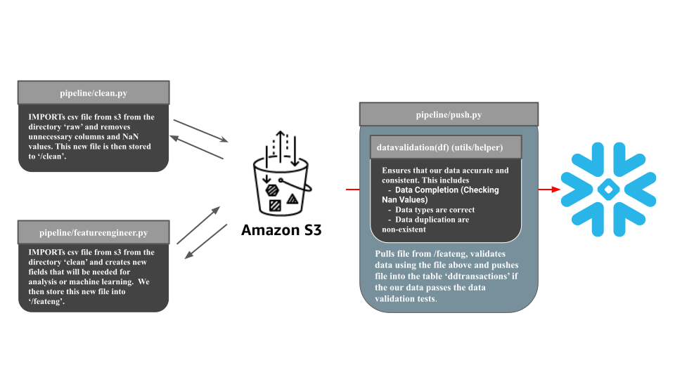

## DoorDash Snowflake pipeline

A manual step-by-step data pipeline that extracts data files from s3, transforms the data, and loads them into a snowflake table. 


## Pipeline Flow



## Dataset Description

We are dealing with DoorDash transactional data. Each row represents a doordash order.


| Field Name      | Description |
| ----------- | ----------- |
| Customer_placed_order_datetime      | The data and time when the customer placed the order |
| Driver_at_restaurant_datetime  | The date and time when the driver arrived at the restaurant|
| Delivered_to_consumer_datetime   | The date and time when the food was delivered to the consumer    |
| Driver_ID   | The ID of the Driver      |
| Restaurant_ID  | The ID of the Restaurant      |
| Consumer_ID  | The ID of the Consumer    |
| Is_New  |  Whether or not the consumer is a new user |
| Delivery_Region  | Region of the customer address |
| Is_ASAP | Customer included|
| Order_total | The total Order amount  |
| Amount_of_discount | Discounted amount towards the Order | 
| Amount_of_tip| Total amount of tips the customer gave|
| Refunded_amount | The amount refunded  | 
| Total_time_elapsed | Total time it took for the order to be delivered after the customer placed the order | 


## S3 description

### The bucket contains 3 directories

| Directory    | Description |
| ----------- | ----------- |
| raw    | The initial directory that was created in our setup script. Contains all the raw files. For convienience, the filenames are simply  |
| clean | Contains cleaned files |
| feateng | The date and time when the driver arrived at the restaurant|


## Pipe-Line Components (/etl)

| script   | purpose | how to run |
| ----------- | ----------- |
| cleaning.py     | pulls the file from the `raw` directory, cleanses it, and saves the copy to `clean`| |
| fe.py  pulls the file from the `clean` directory, adds needed fileds, and saves the copy to `feateng`| |
| push.py  | imports file and validates data. If data is validated, push into warehouse| |


## Getting Started

### Requirements
    -AWS account (IAM user with full access to S3). You need:
        -AWS_ACCESS_KEY_ID
        -AWS_SECRET_ACCESS_KEY
    -SnowFlake account(Used the free trial). You need:
        -Your account username
        -Your account password
        -Your account name
    -Docker Installed on local machine
### Setup

1. Create and env file named `.env` with the content below. Fill in the # with the your snowflake information and AWS keys.

```
snowflake_user = '######'
snowflake_password = '######'
snowflake_account = '######'

snowflake_database = 'ddtosfpipeline' 
snowflake_schema = 'ddtosfpipelineschema' 
AWS_REGION = "us-west-1" 
BUCKET_NAME = 'ddsfpipeline' 


```

2. Build your docker image using the command. This sets up the environment.

```
docker build -t myimage:latest 
```

3. Using the new container, you are able to run the scripts in the containerized command line. Now you can run the setup file using this command line.

```
python3 setup.py
```


### Running the pipeline 
Using the same containerized command line, you can now run the 3 scripts in order.

```
python3 /etl/cleaning.py
python3 /etl/fe.py
python3 /etl/push.py
```

## Data Source


<b>NOTE</b> I believe this dataset is purely synthetic. I am simply using the data set as a way to work with transactional data. Since I am creating this project for learning purposes, the actual data does not really matter. (Any dataset could work)


<b> Tools used:</b>
- Python
- Data lake: [AWS S3](https://aws.amazon.com/s3/)
- Data transformation: [Pandas](https://www.getdbt.com/)
- Data warehouse: [Snowflake](https://cloud.google.com/bigquery)
- Containerization : [Docker](https://www.docker.com/)
<b>


## Future work

-Automating the pipeline using a cron job or using an Orchestration tool such as airflow


